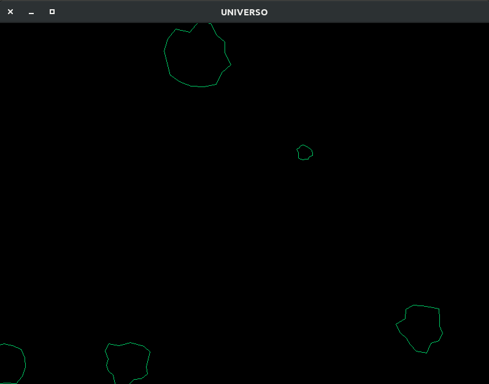
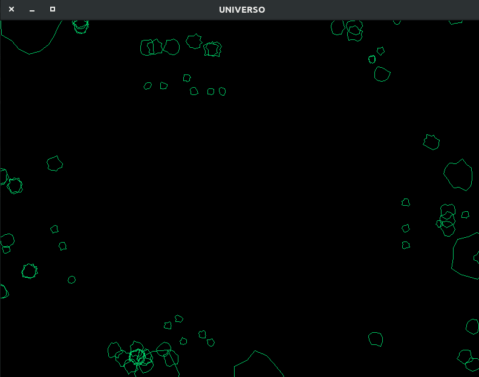

Este es un ejemplo sencillo de asteroides que al colisionar forman pequeños asteroides y desaparecen.

Desarrollado en Ubuntu 17.10 con la biblioteca *X11 GFX*

**Ejecutar**
	./Universo

Compilar desde terminal con archivo Makefile:

**Compilar:**
	make

**Limpiar:**
	make clean

Ejemplo de ejecución

	 
