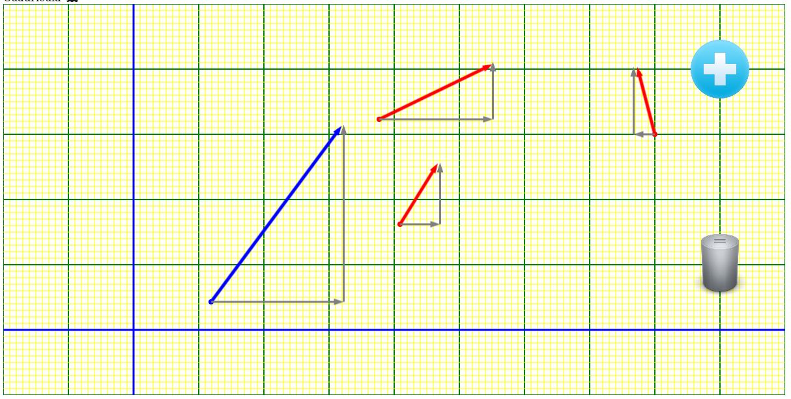
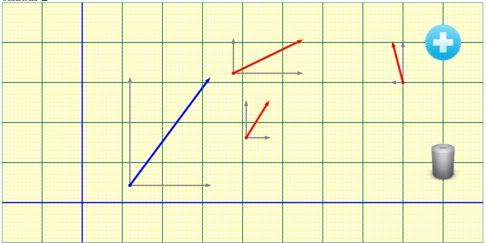
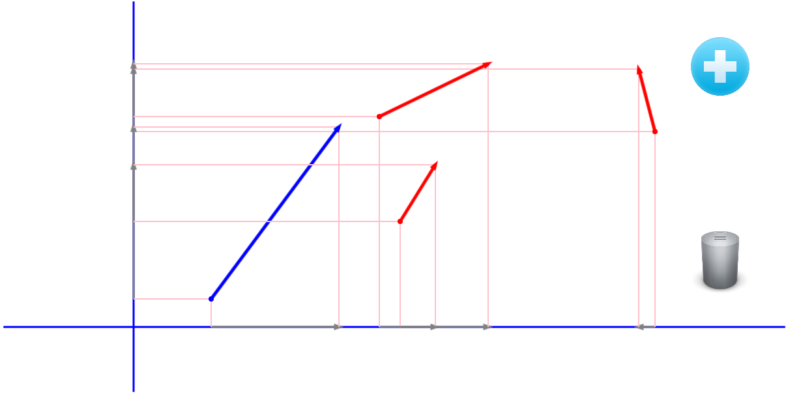

Este es un ejemplo de suma de vectores usando 
Fabric js
Muestra la magnitud, ángulo, componente en x, componente en y del vector seleccionado, así 
como de forma opcional la suma de todos con 
diferentes estilos.

Ejemplo de ejecución

	

 
