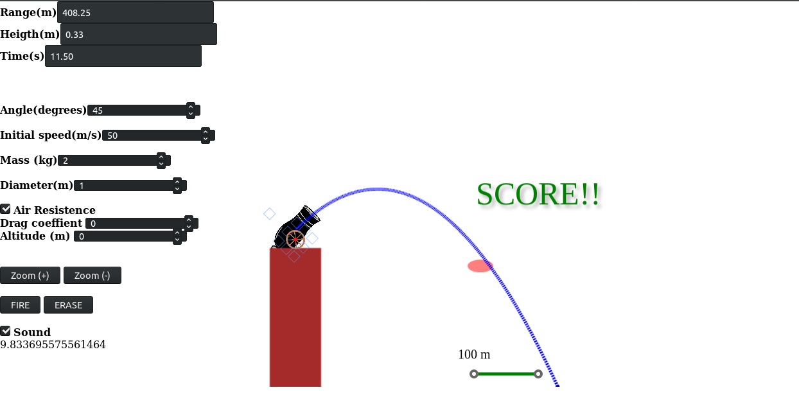

Este es un ejemplo de tiros parabolicos. 
Puedes modificar el ángulo, velocidad inicial,
masa y diametro de la bola del cañon, así como
la resistencia del aire y la altitud. 

Ejemplo de ejecución

